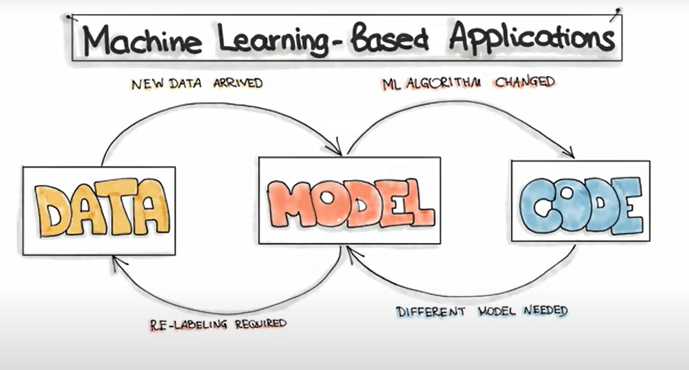

# MLOps

> Just Building Model = Not enough --> just 20% of whole business problem  
> MLE -> 10% ML and 90% Engineering (by [**Elon Musk**](https://twitter.com/elonmusk/status/1315852060852584449))

## 👨‍💻 ML Teams & Roles

1. **Data Scientist** → Discover data, Develop features and train models
2. **Data Engineer** → Builds Production-grade data pipelines
3. **ML Engineer** → Deploys models
4. **Product Engineer** → Integrates ML into applications
5. **Site Reliability Engineer (SRE)** → Set up Monitoring

This will be in a never ending loop in production environment or else, model will start to decay, for example the Spammers change the stratergy of spam mails, reformulation of problem statement, business objective changes or some other reason.

## ML in Real Life

## 🤔 Why MLOps?

It is a set of practices that aims to deploy and maintain ML Models in production reliably and efficient.

MLOps -> Extension of DevOps to include ML and Data Science assets.

- **Simple ML → 🏠 One building**
- **MLOps → 🏙️ Whole city of connected buildings**

## Deployment Challenges

- **⏱️ Performance** → 53% of users leave if site takes >3s to load
- **⚖️ Fairness** → Biased models (e.g., Microsoft trained a model on twitter data, became a racist and was taken down quickly.)
- **🔍 Explainability** → Lot of newer AI rules are comming and need to make the model standard to all of them.
- **🐢 Speed** → Training = days, deployment = weeks if pipelines are weak

## 💡 Model-Centric vs Data-Centric

- **Model-Centric** → Holds the Data Fixed and iteratively improve the Model
- **Data-Centric** → Holds the Model Fixed and iteratively improve the Data

## Key MLOps Questions

1. What business problem are we solving?
2. What’s the cost of wrong predictions?

📦 Example: **Sales Forecasting**
- Overstock → wasted resources
- Understock → lost sales

ROI = (↑ sales + ↓ waste) – (cost of ML system)

## 📝 ML Canvas (10 Blocks)

1. Value Proposition → Define problem & user. Eg: For (target customer) who (need), our (product/service) is (product category) that (benefit).
2. Data Sources → Internal/external + hidden costs.
3. Prediction Task → Classification, regression, anomaly detection... and also about the i/p, o/p and degree of model complexity.
4. Feature Engineering → Working with domain experts to extract feature from raw data like MBBS for medical data, Mathematicians for math related data and so on... also has steps of Selecting the right data, Transforming them (Normalizaion), Crearting of newer data and Encoding.
5. Offline Evaluation → Setting Metrics before deployment
6. Decisions → How users interact with predictions? Possible hidden costs, including human interventions.
7. Making Predictions
8. Collecting Data → For re-training & avoiding model decay
9. Building Models → Deciding the frequency of model retraining. Planning for changes in tech stack and services.
10. Monitoring → Setting Metrics to track system performance post deployment. Understanding corellation between model metrics and business metrics.

⚠️ Always check if ML is worth it. Sometimes simpler solutions win.

## The Building Blocks of ML Software

- **Artifacts** → 📂 Data · 🤖 Model · 💻 Code
- **Phases** → 🔹 Data Engineering · 🔹 ML Engineering · 🔹 Code Engineering

## Engineering Pipelines

A Pipeline is a high-level workflow that organizes a series of tasks (steps) to create a final product. One step is done if the previous step is done.

### 1️⃣ Data Engineering
- Ingestion → Collection of data from various Sources
- Validation → Understanding data content and structure
- Wrangling → Formatting and Cleaning data
- Labeling → Assigning Labels
- Splitting → Splitting data into train/validation/test

### 2️⃣ ML Engineering
- Training → Model Training
- Evaluation → Model Evaluation
- Testing → Model Testing
- Packaging → Exporting model into consumable format for business application

### 3️⃣ Deployment
- Serving → Addressing Model in production environment
- Monitoring → Observing performance
- Logging → Recording every inference request

## Tools

Using **ZenML** for pipeline development, execution, and management.